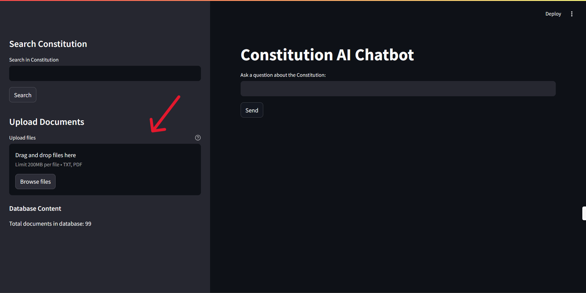
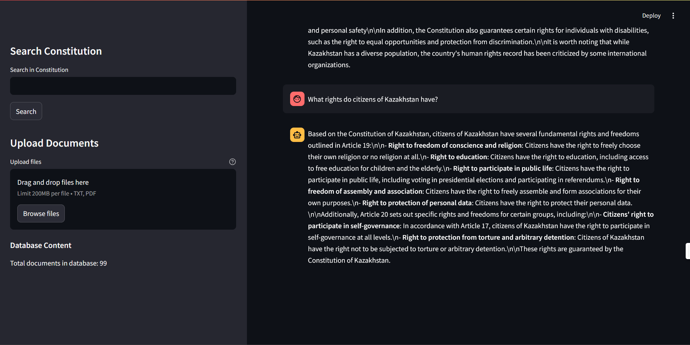

# AI Assistant for the Constitution of the Republic of Kazakhstan ƪ(˘⌣˘)ʃ

## Overview
This project is a **Minimum Viable Product (MVP)** of an AI-powered assistant designed to answer questions related to the **Constitution of the Republic of Kazakhstan**. The assistant is built using **Streamlit** for an interactive user interface and utilizes **RAG Fusion** and **multi-query generation** for more accurate responses. The model is integrated with **Ollama**, and all queries and answers are stored in a **vector database**.

## Features
- **Multi-query and RAG Fusion**: Enhances the accuracy of responses by generating variations of user queries and retrieving the most relevant information.
- **Chat Functionality**: Enables real-time interactions with the assistant through a conversational interface.
- **LLM Integration**: Utilizes **Ollama** for generating intelligent and contextual responses.
- **Vector Store for Query Storage**: Stores embeddings of documents and user queries in **MongoDB/ChromaDB**.
- **File Upload Support**: Users can upload one or multiple text or PDF files to enrich the assistant's knowledge base.
- **Context-Aware Responses**: Answers questions within the context of uploaded documents.

## Installation
### Prerequisites
Ensure you have the following installed:
- Python 3.8+
- Streamlit
- MongoDB (for storing document embeddings)
- Ollama (for LLM integration)

### Setup
1. Clone this repository:
   ```bash
   git clone https://github.com/your-repo/ai-constitution-chatbot.git
   cd ai-constitution-chatbot
   ```
2. Install dependencies:
   ```bash
   pip install -r requirements.txt
   ```
3. Start MongoDB server:
   ```bash
   mongod --dbpath /path/to/your/db
   ```
4. Run the application:
   ```bash
   streamlit run app.py
   ```

## Usage
### Uploading Documents
1. Navigate to the **Upload Documents** section on the sidebar.
2. Click the **Upload Files** button and select text or PDF files.
3. The assistant will process and store the document embeddings in the vector database.
   



### Asking Questions
1. Enter a question in the text input field.
2. Click **Send** to receive an answer based on:
   - The stored constitutional documents.
   - Any uploaded documents providing additional context.
3. View responses in the chat interface.
   


### Viewing Search Results
1. Enter a query in the **Search in Constitution** field on the sidebar.
2. Click **Search** to retrieve the most relevant articles from the database.

## Examples
### Example 1: Searching the Constitution
- **User Input:** "What are the fundamental rights of citizens?"
- **Bot Response:** "According to Article X of the Constitution, citizens have the right to..."

### Example 2: Asking About an Uploaded Document
- **User Uploads:** `Human_Rights.txt`
- **User Input:** "Explain the right to education as per the uploaded document."
- **Bot Response:** "The uploaded document states that all citizens are entitled to free primary education..."

## Technologies Used
- **Python**: Core programming language.
- **Streamlit**: For interactive UI.
- **MongoDB/ChromaDB**: Vector database for storing document embeddings.
- **Ollama**: LLM for generating responses.
- **NumPy**: For vector calculations and similarity search.

## Future Improvements
- **Support for More LLMs**: Extend compatibility to OpenAI, Gemini, and Groq models.
- **Enhanced File Processing**: Add support for scanning PDFs and extracting text.
- **Improved Retrieval Algorithms**: Implement more advanced similarity search techniques.
- **User Authentication**: Add login and session management for personalized experience.

## Contributors
- **Ayana** – Developer & Maintainer
- **Dariya** – Developer & Maintainer
- **Dana** – Developer & Maintainer

## License
This project is licensed under the **MIT License**. Feel free to use and modify it as needed.
